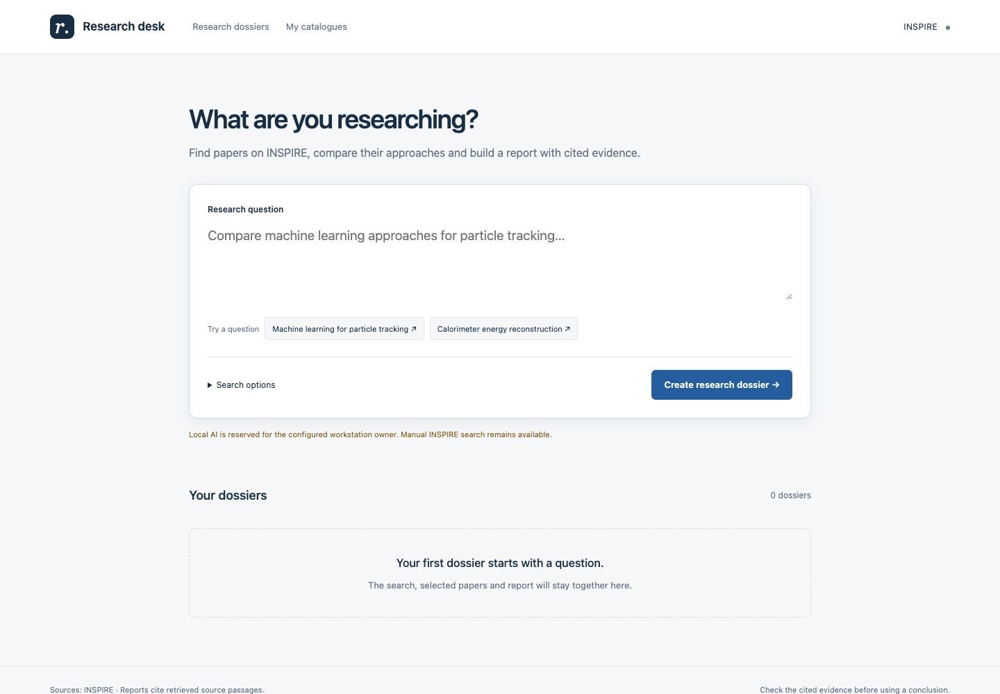
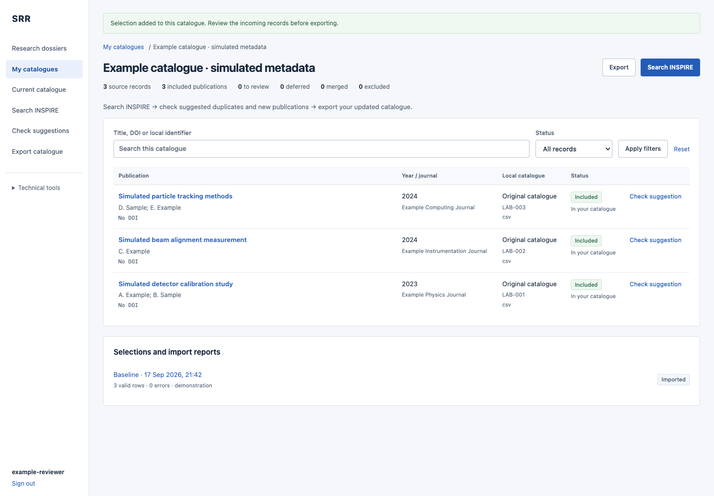
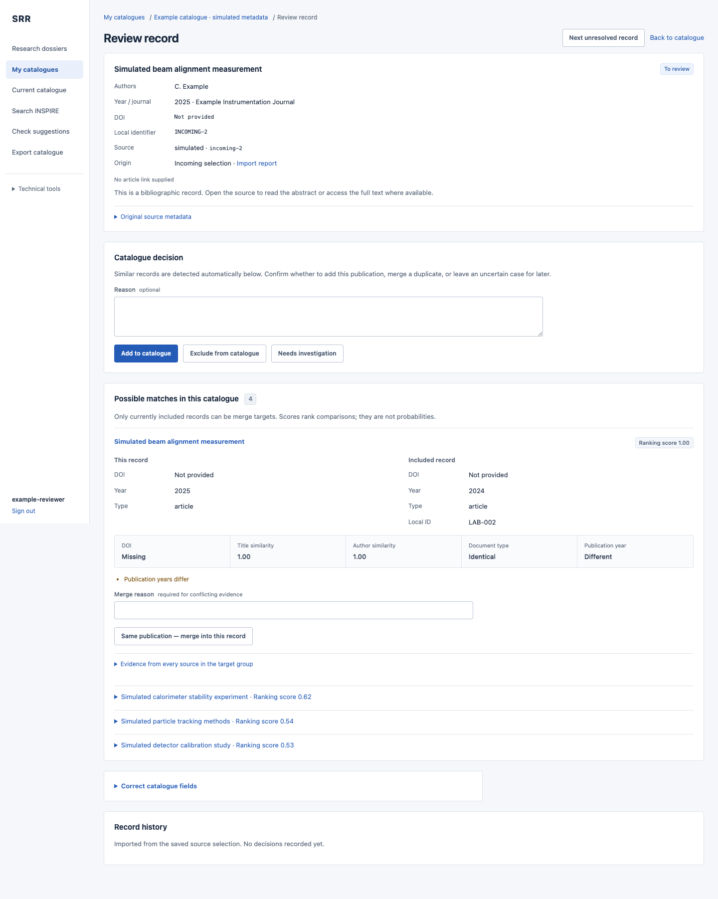

# Research Desk

[](https://github.com/airope/research-desk/actions/workflows/ci.yml) [](LICENSE)

A local-first research workspace for turning a scientific question into a reading dossier and a source-linked draft report. Search INSPIRE, select papers, inspect available PDF passages, ask focused follow-up questions, and keep earlier report versions with their evidence.

Research Desk also includes publication-catalogue tools: import a CSV, review incoming records, resolve duplicates and metadata conflicts, and export a catalogue with a change report. These modules share a Django/PostgreSQL application but keep private user work separate from the public metadata demonstration.

**Experimental, human-reviewed software.** A verified quotation is not a verified scientific conclusion. This is an independent project, not a CERN or INSPIRE product, partnership, or endorsement.

## Screenshots



*Actual application capture from an isolated local profile. No live model was called for this screenshot.*

<details>
<summary>Publication catalogue and evidence-based review</summary>





*The catalogue screenshots use the application's simulated examples, not private records or completed AI-generated research.*

</details>

## What is included

| Workspace | Capabilities | Starting point |
|---|---|---|
| Research | Editable search plans, bounded INSPIRE searches, abstract/PDF evidence, cited synthesis, follow-up questions, report history, Markdown/BibTeX and browser print exports | `/` |
| Private catalogues | CSV previews, simulated examples or live INSPIRE acquisition, human review, field corrections, catalogue and audit CSV exports | `/workspaces/` |
| Reference reconciliation | Offline Crossref/OpenAlex fixtures, comparison signals, retained source versions, reversible decisions and field provenance | `/review/` |

Optional features include a bounded investigation loop and Elasticsearch BM25 passage search. The default passage backend uses local keyword ranking. The separate title-embedding experiment is **not** used to merge publications automatically.

## Start locally

Use Docker Compose, or a native Python/PostgreSQL environment. Initial package and image downloads need Internet access. The committed **catalogue/reconciliation demo** runs without provider credentials; it does not generate offline AI reports or prepopulate a research dossier.

### Docker Compose

```sh
git clone https://github.com/airope/research-desk.git
cd research-desk
docker compose up --build -d
docker compose exec web python manage.py demo
docker compose exec web python manage.py createsuperuser
```

Open [http://localhost:8000](http://localhost:8000). Sign in to create a research dossier or private catalogue. For the ready-to-browse offline fixture, open [the review queue](http://localhost:8000/review/).

Compose starts PostgreSQL, migrations, the web application and both queue workers. The web port binds to loopback; the database is not exposed. **This is a local demonstration configuration, not a secure Internet deployment recipe.** No model is enabled for generation by default. Docker build and PDF sandbox compatibility must be verified on your target host; configuration files alone are not execution evidence.

### Native development

Requirements: Python 3.12 (the project accepts 3.12–3.14), [uv](https://docs.astral.sh/uv/), and PostgreSQL 17. Provision a database and role named `srr` before running these commands. The database role needs permission to create the `pg_trgm` extension; the test role also needs permission to create a test database. SQLite is not a substitute.

```sh
uv sync --frozen --managed-python
export PGHOST=127.0.0.1 PGPORT=5432 PGDATABASE=srr PGUSER=srr
# Configure PGPASSWORD for your local database in your environment or project .env.
uv run python manage.py migrate
uv run python manage.py demo
uv run python manage.py createsuperuser
uv run python manage.py runserver 127.0.0.1:8000
```

In another terminal, with the same database and provider configuration:

```sh
uv run python manage.py research_worker
```

For queued legacy metadata imports, run `uv run python manage.py worker` in a separate terminal. Private catalogue previews and reviews do not require either worker.

Settings read the project `.env`, with process variables taking precedence. See [.env.example](.env.example); the native default database port is `55432`, so set `PGPORT` to match your PostgreSQL installation. PDF extraction requires macOS `sandbox-exec` or Linux `bubblewrap` with usable namespace isolation. Native Windows PDF extraction is not supported by this implementation.

## Enable research generation

The research workflow is **live**, not a fixture-based AI simulation:

1. Configure an explicit provider and, where required, an API key in your local `.env`, following [LLM provider setup](docs/llm-providers.md). A local OpenAI-compatible model server is also an option.
2. Restart the web application and research worker after configuration changes. With Compose, recreate the services using `docker compose up -d`.
3. Sign in, enter a question, review or edit the proposed INSPIRE queries, and start the search.
4. Select papers, inspect the evidence and request a draft report. Optionally read supported PDFs, ask a follow-up or start a bounded investigation.
5. Check each claim against its source before using or sharing the report.

INSPIRE searches and PDF downloads require network access, even with a local model. Without generation configured, manual queries and saved-paper review remain available. The personal Codex CLI integration is a separate, explicitly enabled development-only option for one configured local account; running a CLI locally does **not** mean its inference is offline. Compose disables that integration.

Provider calls may incur charges and transmit your question and selected source text. There is no automatic provider fallback or automatic retry of a paid generation request. Cancellation cannot refund an accepted request. Read [privacy and network behavior](docs/privacy-and-network.md) before enabling a provider.

## Limits that matter

- Research searches are bounded, not exhaustive or a systematic literature review. A dossier holds up to 20 papers; investigation has a three-action budget and can add at most six papers.
- PDF acquisition is restricted to supported arXiv/INSPIRE endpoints: up to six documents per run, 15 MiB per download, 40 physical pages and 150,000 extracted characters per document. There is no OCR, figure interpretation or reliable table/formula reconstruction.
- Passage retrieval supplies at most 4,000 characters per paper and 80,000 overall. Relevant evidence can be missed. BM25 is lexical retrieval, not a semantic vector index.
- Citation checks validate known sources, physical page references and exact quotes, not whether a claim follows from its evidence. No independent scientific-quality benchmark is established.
- Catalogue similarity scores are ranking signals, not probabilities. Associations require human decisions. Existing benchmarks combine synthetic labels and DOI-derived weak labels, not expert annotations.
- Private work is access-controlled, not encrypted by the application. Source texts, reports and audit history are persisted. Check source rights before sharing exports or screenshots.

## Development and documentation

```sh
uv run pytest -q
uv run ruff check .
uv run python manage.py check
uv run python manage.py makemigrations --check --dry-run
```

Tests require PostgreSQL. Default tests use fixtures and mocked external providers; they do not establish live provider compatibility, scientific accuracy or successful container deployment. Optional Elasticsearch integration and model-download experiments have separate prerequisites.

- **Research:** [workflow and evidence limits](docs/research-mvp.md), [investigation](docs/research-investigation.md), [providers](docs/llm-providers.md), [Elasticsearch](docs/elasticsearch.md), [evaluation protocol](docs/research-evaluation.md).
- **Catalogues:** [user guide](docs/catalogue-guide.md), [architecture](docs/architecture.md), [API examples](docs/api.md), [OpenAPI schema](docs/openapi.yaml), [operations](docs/operations.md).
- **Experiments:** [benchmark](docs/benchmark.md), [embedding experiment](docs/embedding-experiment.md), [fixture provenance](data/README.md).
- **Verification:** [executed checks and limits](docs/VERIFICATION.md), [dependency license inventory](docs/dependency-licenses.md).
- **Project:** [contributing](CONTRIBUTING.md), [security](SECURITY.md), [privacy/network](docs/privacy-and-network.md), [third-party rights](docs/third-party-notices.md).

Some deeper guides retain the earlier “Scholarly Record Reconciliation” (SRR) name and historical validation notes. SRR remains the internal Django package/database identity; those notes are not evidence that every current release has been revalidated.

## License

Project code and original documentation are available under the existing [MIT License](LICENSE). Upstream metadata, article abstracts/full text, model weights and dependency distributions have their own terms; the MIT license does not relicense them. See [third-party notices and data boundaries](docs/third-party-notices.md).
