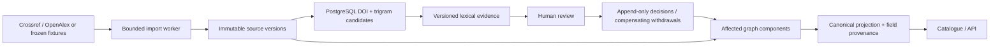

# Architecture

SRR is a modular Django monolith with PostgreSQL as its only required stateful dependency. A separate process claims durable import jobs from the same database. HTTP fetching happens outside graph transactions. Public reads use Django templates and DRF; authenticated curator/operator actions call the same domain services.

## Identity and audit

A source identity is `(provider, external_id)`. DOI is searchable but never a cross-provider uniqueness constraint. A content digest excludes local fetch time and includes the selected raw bibliographic snapshot, normalized values and normalization version. Repeated observations reuse the existing version; a prior content state can become current again without changing its historical version.

Source versions, match proposals and review decisions have PostgreSQL triggers preventing UPDATE and DELETE. The application database owner can deliberately change schema/triggers; this is an application integrity boundary, not tamper-proof forensic storage.

Pairs are UUID-ordered with database uniqueness and ordering constraints. Decisions include exact compared versions through their immutable proposal, actor, reason, expected revision and actor-scoped idempotency fingerprint. A withdrawal creates a compensating event. Graph components derive from active accepted edges. Active rejected edges block contradictory transitive unions. A deliberate metadata conflict override requires a reason.

Graph mutations take a transaction advisory lock. This simplifies cross-pair race prevention for the bounded corpus. Reads remain concurrent. The tradeoff is serialized graph writes, not an assertion of high-volume write scalability. Revisions of affected pairs change when group membership or source evidence changes, preventing stale withdrawal previews from being applied silently. Recalculation is limited to affected groups; no global catalogue rebuild occurs on a decision.

## Canonical identity and projection

Unchanged groups retain IDs. Changed groups receive new IDs; replaced IDs remain accessible and expose successor IDs, including multiple successors after a split. Historical memberships retain validity intervals and origin decision IDs. Each nonempty projected field stores value, exact source version, JSON path and selection policy. The initial policy prefers Crossref then OpenAlex, not longest text. Alternatives remain in source versions. Human field correction is not yet exposed; it requires its own append-only correction event.

## Retrieval and evaluation

The indexed title key preserves Unicode, digits and negation. Candidate generation unions an untruncated exact DOI search with a PostgreSQL trigram top-K query. Pair ordering deduplicates the union. All candidate evidence is a review recommendation; no automated associations are enabled.

The benchmark uses the same candidate retrieval against partition-specific records in rolled-back PostgreSQL transactions. It does not mutate demo decisions or labels. Synthetic stress cases and DOI-derived weak labels are reported separately; neither is represented as expert annotation. Optional embeddings remain offline experiments.

## Security and operation

Django sessions and CSRF protect mutations. Staff or curator/operator groups grant explicit capabilities. Anonymous visitors can read; provider URLs and filesystem paths are never accepted from the API. External fetching is off by default and acquisition remains an explicit operator command. Templates escape source strings. Jobs expose durable page snapshots, item outcomes, counters, leases and failures. The worker is intentionally a bounded importer, not a generic scheduler.
